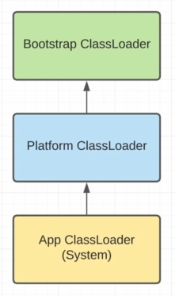

# ClassLoader

1. **Bootstrap ClassLoader** - встроен в JVM, загружает критически важные классы, в нем находится класс ClassLoader, который загружает другие классы, например которые находятся в Java Base Модуле.  <mark style="color:orange;">СРАЗУ ЖЕ ЗАГРУЖАЕТСЯ В ПАМЯТЬ</mark>
2. Platform ClassLoader -  загружает другие модули, которые не так критичны. <mark style="color:orange;">LAZY</mark>
3. &#x20;App ClassLoader (System)(Системный загрузчик) -  загружает написанные нами классы, и некоторые пакеты из java модулей. <mark style="color:green;">**Загружает все классы из - classpath**</mark> . <mark style="color:orange;">LAZY</mark>

